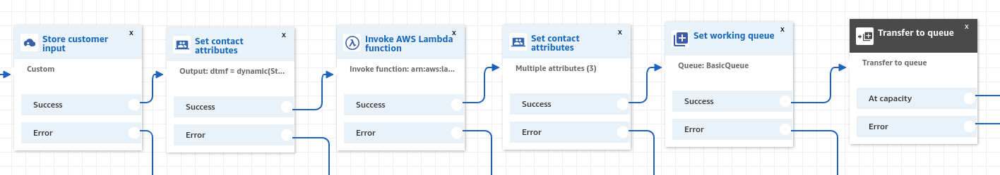
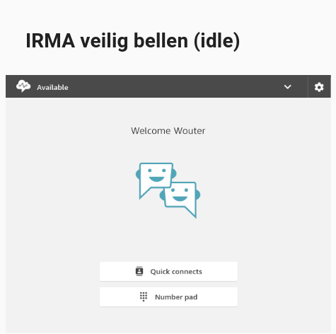
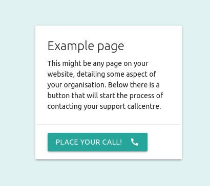
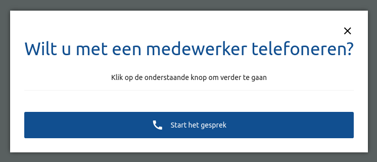
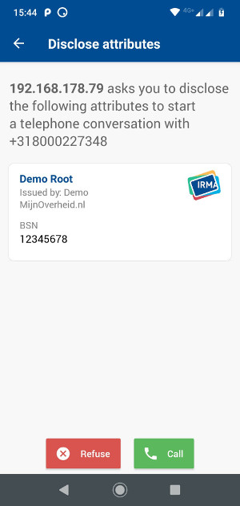
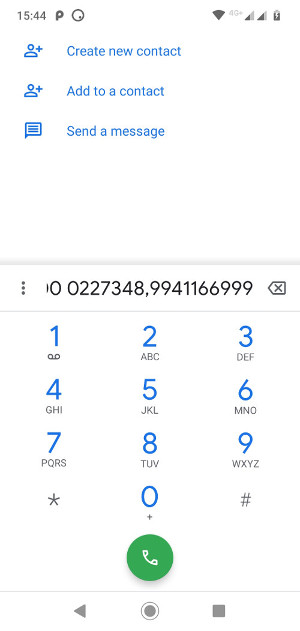
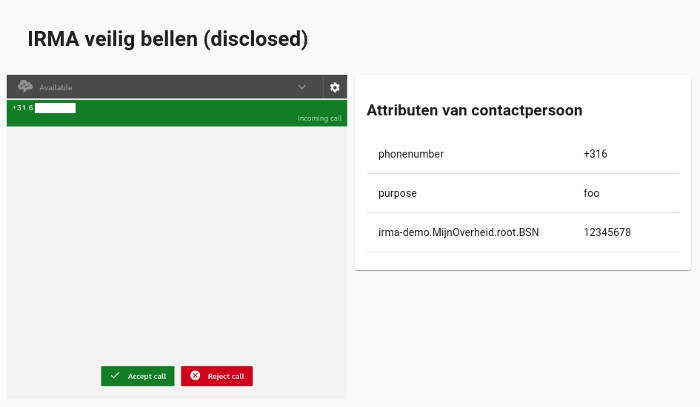

# IRMA veilig bellen

IRMA veilig bellen is a project to allow municipalities to accept calls from
citizens authenticated with IRMA. This means the identity of the calling citizen
no longer needs to be checked by asking for their postal code and birth date.
Instead, the citizen will be guided to authenticate using the IRMA app, which
provides cryptographic proof of their credentials. The credentials requested can
be context-specific and can include their citizen identification number, their
address and their age. For more information on IRMA, see [irma.app](https://irma.app).

**Warning**: each call is still placed using the GSM network, and the voice data is not encrypted by Veilig Bellen. Veilig Bellen merely provides a mechanism for call centers to view disclosed IRMA credentials for incoming calls securely.

**Note**: this project is heavily dependent on Amazon Connect. It might be feasible to adapt it to another call center as a service provider, but will require significant effort.

The project consists of a number of components:
- A backend which can be run multiple times to allow some amount of redundancy.
- A public frontend library which provides the user interaction for citizens to make authenticated calls. This library can be embedded in any website. We also provide a demo website that uses this library.
- An agent frontend which call center agents can use to accept calls and read
  any provided credentials.
- A panel frontend which shows metrics such as the number of available agents
  and the number of ongoing calls. This panel can be shown on a screen in the agent call center.
- An Amazon lambda used to connect Amazon Connect with the backends.
- A database schema to be used in a PostgreSQL database.

## Development workflow

As this project is dependent on Amazon Connect, you will require a live Amazon Connect instance running configured to accept calls for Veilig Bellen. Also you will need to proxy API calls from Amazon Lambda to your development instance using a public-facing reverse proxy. You can set up all Amazon services at [Amazon AWS](https://aws.amazon.com/).

**Note**: the development environment uses various `*.test.tweede.golf` hostnames, which point to `localhost`.

### Reverse proxy

We generally rent a VPS with a public-facing IP-address and use a SSH reverse proxy:

```bash
ssh irma-proxy@<host> -N -R 8080:localhost:8080
```

Or you can poke a hole through your local firewall and forward traffic to your local development machine.

### Amazon Lambda

Once your have the host or IP-address of this reverse-proxy, you can configure the Amazon Lambda call. You can find the code for this call in [`/amazon/call-lambda.js`](amazon/call-lambda.js). Run it as `Node.js 12.x`, with as handler `index.handler`. Set the `CALL_URL` environment variable to `http://<proxy-host>/call`. For production it is important that you only use HTTPS for this call. For development HTTP is fine though, as long as you do not provide real IRMA credentials to Veilig Bellen.

### Amazon Connect

You will now need to create an Amazon Connect instance from the AWS Amazon Connect page.

#### Instance setup

You will have to configure the Identity Management for your instance. Currently Veilig Bellen has been developed with 'Store users within Amazon Connect' in mind, but due to how Amazon Connect Streams handles authentication it is our desire to also support SAML 2.0-based authentication. A Merge Request for this is highly welcome. For now pick the 'Store users within Amazon Connect'-option and proceed along the setup wizard. When asked you obviously want to accept incoming calls.

#### Instance configuration

Once setup your can configure the 'Approved origins' in 'Application integration'. For development you will want to add `https://agents.veiligbellen.test.tweede.golf`. For production you will want to add your own agent website.

Under 'Contact flows' you will want to add the Amazon Lambda call you created in the previous section.

Please write down the Amazon Connect instance ARN, specifically the last segment i.e. `503d5d31-de38-4803-bb39-02e98ee8891c`. Also remember which region you created the instance in, i.e. `eu-central-1`.

#### Instance administration

Under 'Overview' you can find your Login URL, i.e. `https://<instanceid>.awsapps.com/connect/login`. Please login using your Admin user.

#### Contact flow

You will need to set up a contact flow before doing anything else.
For your convenience we have exported our demo contact flow and committed it as [`/amazon/contact-flow.json`](amazon/contact-flow.json).



In essence it is comprised of the following:

* Store customer input, with a custom customer input of maximum 10 digits.
* Set contact attributes, to set the previous customer input as an attribute to save to the key `dtmf` of Type `System` with Attribute `Stored customer input`.
* Invoke AWS Lambda function, using the previously made Lambda function, with as Function Input Parameter the text with Destination key `call_state` and value `queued`. The earlier `dtmf` value will automatically be passed on as well.
* Set contact attributes with:
  * The attribute `session_secret` of Type `External` and Attribute `session_secret`.
  * The text `dtmf` with the value `-`, to erase the DTMF such that the KCC employees can not replay a call.
  * The attribute `phonenumber` of Type `System` and Attribute `Customer Number`.
* Set working queue, to your queue of choice, probably just `BasicQueue`.
* Transfer to queue

Now save and publish this contact flow.

#### Phone number

When creating a phone number you can couple the aforementioned contact flow. Please write down your chosen phone number.

#### Queue

To display the metrics on the status panel frontend please go to your aforementioned queue and fetch the identifier from last part of the page URL, i.e. `f3860ab3-8305-4862-940e-9f6b608f9530`.

### Amazon IAM

In order to fetch call and queue statistics from Amazon Connect we require an Amazon API user to access the Amazon Connect API. This user requires the `AmazonConnectReadOnlyAccess` policy, or the `Connect` `list` and `read` permissions.

Remember the `ID` and `SECRET` belonging to this user and set them as a file under `bin/env.sh` as follows:

```bash
export BACKEND_CONNECT_ID=AKIA0000000000000000
export BACKEND_CONNECT_SECRET=?
```

This file is already added to `.gitignore`, and thus there is no danger of committing it to the repository. In your local terminal, run `source bin/env.sh` to set these variables. If you do not use bash you will have to change your environment appropriately.

### Docker-compose

In order to run the development project you require `docker` (version 19.03) and `docker-compose` (version 1.25) installed. It has been tested to work on any plain Ubuntu 18.04.1 LTS.
`docker-compose.yml` defines a cluster consisting of the three
frontends, any number of backends, a Postgres server, an IRMA server and an
Nginx server. You will need to adapt the `docker-compose.yml` file to your situation. Given a registered phone number coupled to your contact flow, and the aforementioned Amazon Connect instance id, region and queue id, you will need to set it up in `docker-compose.yml` under:

    - BACKEND_PHONENUMBER=+318000123456
    - BACKEND_CONNECT_INSTANCEID=503d5d31-de38-4803-bb39-02e98ee8891c
    - BACKEND_CONNECT_QUEUE=f3860ab3-8305-4862-940e-9f6b608f9530
    - BACKEND_CONNECT_REGION=eu-central-1

Also you need to set up the `frontend_agents` service using your connect ID:

    - CCP_HOST=<instanceid>.awsapps.com

To set up a cluster of local docker containers, run:

```bash
bin/setup.sh
```

After bringing up the docker containers for the first time, the database will
not have a schema yet. Use the following command to initialize it.

```bash
docker exec -i veilig-bellen_psql_1 psql -U tg -d tg < database/schema.sql
```

To start the cluster with three backends:

```bash
bin/up.sh --scale backend=3
```

### IRMA

You will need the IRMA app installed on a device, preferably on a telephone with access to the GSM network. Onto this app you must load credentials to disclose to Veilig Bellen. Which credentials you can use are configured in the *purposeMap* in the docker-compose file. For how these credentials work we refer to [the IRMA documentation](https://irma.app/docs/session-requests/#disclosure-requests). Suffice to say by default we have a *Demo* attribute for the Dutch equivalent of a unique citizen identifier, the BSN, configured. You can preload any value for this demo credential by filling in the form on the [credentials documentation page](https://privacybydesign.foundation/attribute-index/en/irma-demo.MijnOverheid.root.html).

**Note**: The device with your IRMA app should be able to reach the IRMA go server instance running in Docker on your development machine. Normally this is the case if both the development machine and your phone are on the same wifi network for consumer settings. You might need to set up a reverse-proxy for your IRMA server, or use a different public IRMA server.

At the time of writing this README document a new version of the IRMA app is about to be released. This app includes a special interaction for directly starting a telephone call which Veilig Bellen gratefully uses. However the currently released version of the app does not provide this interaction, and hence the phone number to call may be scanned using a QR code, or copied over by hand.

### Testing

Now we are ready to actually test and use the project. Because we employ self-signed certificates for running the project, we first need to whitelist the hostnames in the browser.

1. Start by visiting the session request endpoint of the backend and accept the self-signed certificate for that hostname:

    <https://backend.veiligbellen.test.tweede.golf/session?purpose=foo>

    Note that we request a session for the purpose 'foo'. Normal purposes would be 'garbage-collection' or 'benefits'.
    ```json
    {
      "sessionPtr": {
        "u": "http://192.168.178.79:8088/irma/session/Ohyd1JCHGaFpOqpxoi3b",
        "irmaqr": "disclosing"
      },
      "phonenumber": "+318000227348,5362149328",
      "dtmf": "5362149328"
    }
    ```
2. Now visit the agent frontend. You may need to log in again in a separate tab. Do so, and that tab will close. Make yourself 'available' as an agent, and keep this page open:

    <https://agents.veiligbellen.test.tweede.golf/>

    
3. Now visit the public demo frontend:

    <http://public.veiligbellen.test.tweede.golf/example.html>

    This is an example page that makes use of a library that enables the IRMA Veilig Bellen interaction. The button before you simply starts this interaction, for a given backend and purpose.

    
4. Press the button, and follow the instructions.


---
5. The IRMA app will start the dialer of your phone, call this number.

    
    
6. You will hear a series of beeps, and will subsequently be placed on hold.
7. Your agent frontend should now notify you of an incoming call, and show the disclosed attributes.


---
8. Pick up the call and have a conversation with yourself.
9. Finally you can view the state of the Veilig Bellen system in the status panel:

    <https://panel.veiligbellen.test.tweede.golf/>

## Manual build frontends

You may wish to manually build the three frontends and deploy them by copying the generated distributables.

You can build your own frontend manually by running:

    docker-compose run -e BACKEND_URL="https://foo" -e IRMAJS_LANGUAGE=nl frontend_public yarn run build-example

    docker-compose run -e BACKEND_URL="https://foo" -e CCP_HOST="example.awsapps.com" frontend_agents yarn run build

    docker-compose run -e BACKEND_FEED_URL="wss://foo/agent-feed" frontend_panel yarn run build

You can build the public library by running:

    docker-compose run frontend_public yarn run prepare

Generally all build artifacts can be found in the `/dist` folder of the respective subprojects. These artefacts can be placed in any webroot to serve them, for example on Amazon S3.

See [/frontend-public/src/example.html](frontend-public/src/example.html) for an example on how to include the button in your web page.

## Production

To bring the project into production, you will need to configure the following:

- Amazon Connect as detailed above.
- A Postgres database must be configured and loaded with `database/schema.sql` as detailed above.
- An IRMA server must be configured. See `docker-compose.yml` for an example
  configuration.
- One or more backends must be deployed. Travis CI provides up-to-date backend
  docker images for the master branch. Again, see `docker-compose.yml` for
  example configuration, but run the command as specified in the docker image instead of `watch.sh`, which is only for development intended and not provided in the production docker image.
- A reverse-proxy needs to be configured to serve the backend API over HTTPS.
- Manually build the frontends and serve them on S3 or similar.
- Include the public library on your intented usecase website, and provide a button calling the interaction as in [/frontend-public/src/example.html](frontend-public/src/example.html).

## Release artefacts

Our CI builds release artefacts for every commit in master. These can be
downloaded from the Github releases page: https://github.com/tweedegolf/veilig-bellen/releases

We use the Nix package manager to build our release artefacts. You will not need
it unless you need to make changes to CI. Nix will not interfere with your
system and will prevent your system's specifics from interfering with this
project's builds. Nix can be installed with:

    bash <(curl https://nixos.org/nix/install) --daemon

This will create a directory in root, `/nix`, which stores all Nix packages,
some nixbld users, a nix-daemon systemd service and make some changes to your
system's `bashrc` in order to extend your `PATH` with Nix. For more information,
see the Nix manual: https://nixos.org/nix/manual/

To build the public frontend locally:

    nix-build -A frontend-public

This will leave a symlink called `result` which points to the resulting frontend
library.

The build for the backend docker container is similar, but requires a `vendor`
directory for the backend as created by `go mod vendor`.

    nix-build -A backend-image

The resulting docker container can be loaded with:

    docker load < result

Or combine the steps with:

    docker load < $(nix-build -A backend-image --no-out-link)

The backend image contains the backend as well as some basic unix tools. The
backend is located at `/bin/backend`.

Nix will cache builds and dependencies so builds are instant when no changes are
made. If `/nix` becomes too large, it can be cleaned up with
`nix-collect-garbage`.

To ensure reproducability, all dependencies are locked, both by the lockfiles of
the respective subprojects (`go.sum`, `yarn.lock`) and by `nix/sources.json`. To
update the lockfiles of the subprojects, see their respective tooling. To update
`nix/sources.json`, you will need `niv`. Install it with `nix-env -iA
nixpkgs.niv`. Run `niv update` from the repository root to update the
dependencies, then run the builds as before to check that they still build.
